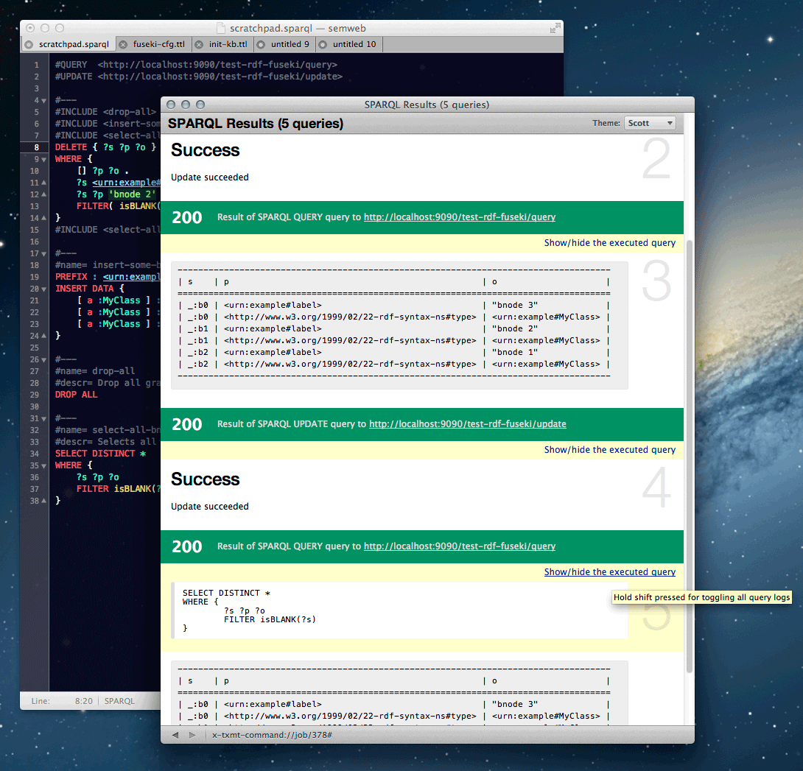
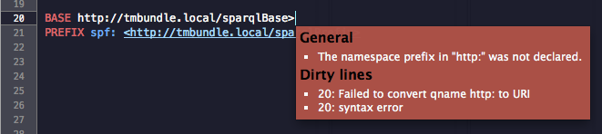
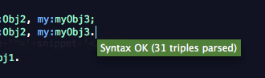
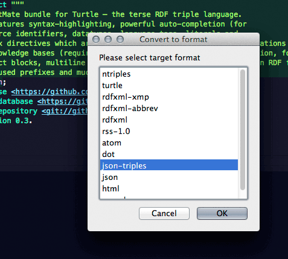
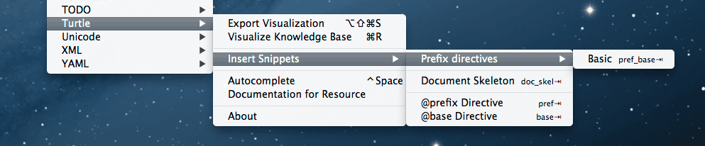
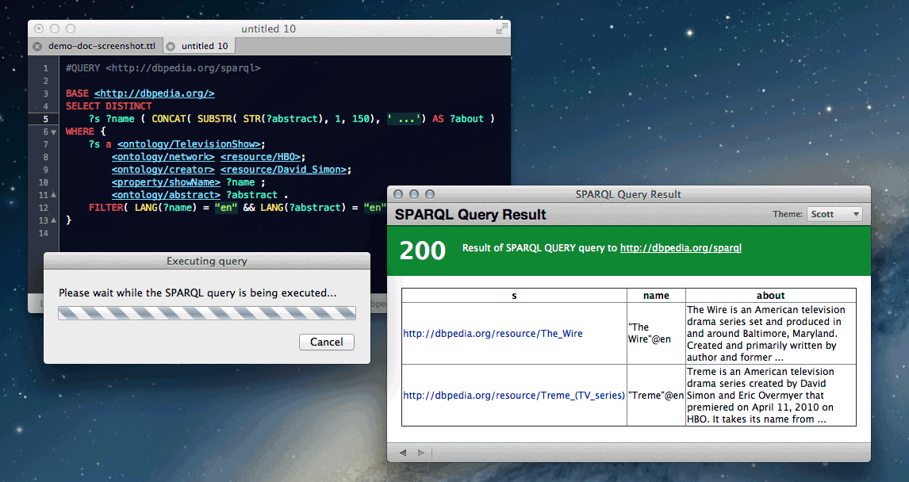
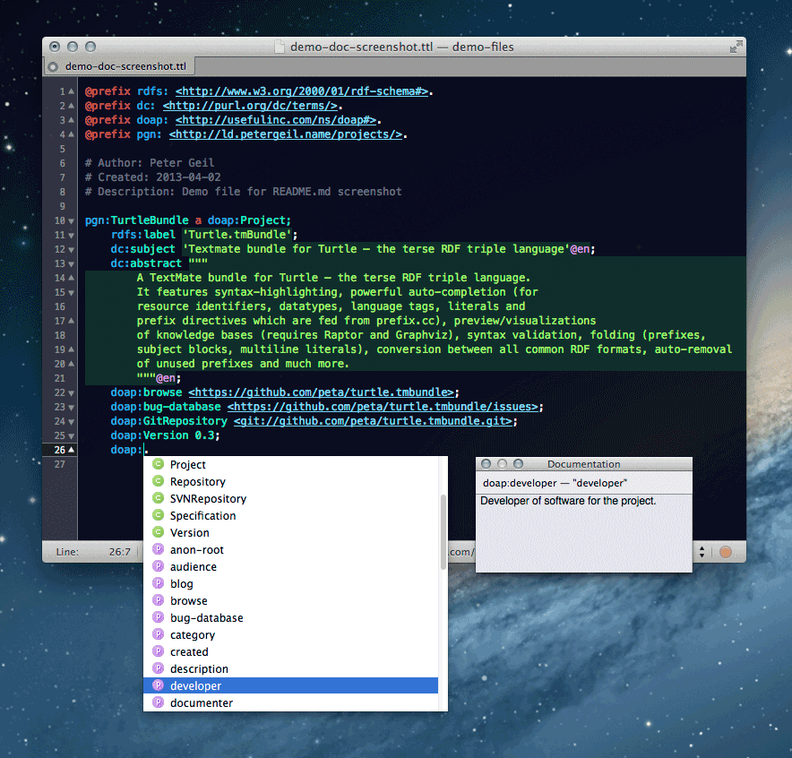
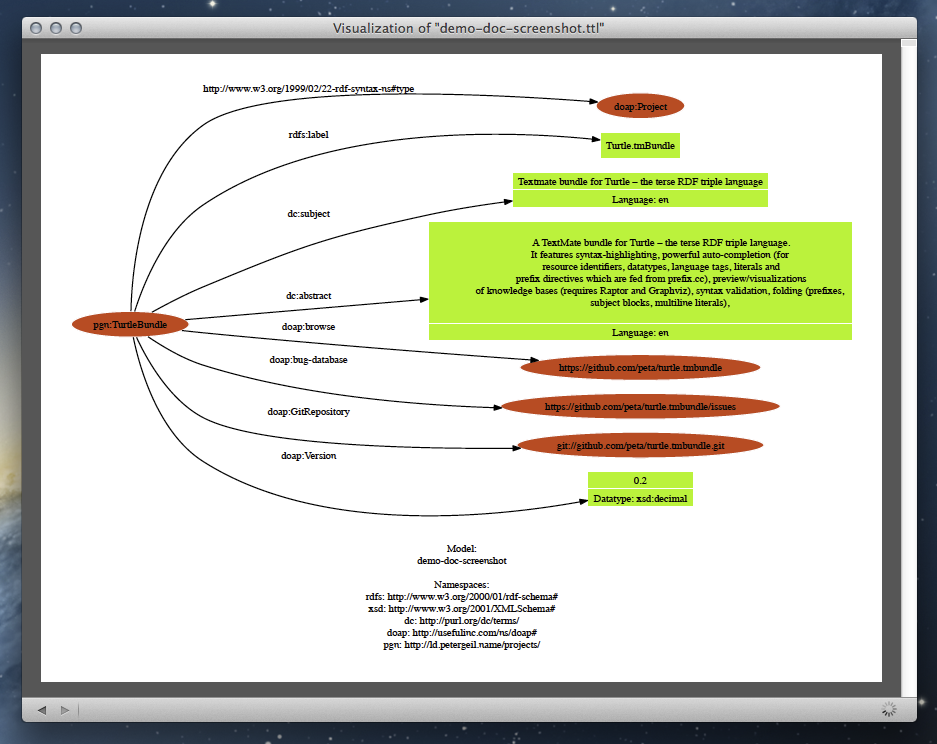

# turtle.tmbundle
---------------------------------------------------------------------

Totally awesome bundle for Turtle – the terse RDF triple language.

It consists of:

+ Language grammar for Turtle and SPARQL 1.1
+ Powerful auto-completion (live-aggregated)
+ Documentation for classes and roles/properties at your fingertips (live-aggregated)
+ Interactive SPARQL query scratchpad
+ Some snippets (prefixes and document skeleton)
+ Solid syntax validation
+ Commands for instant graph visualization of a knowledge base (requires Graphviz and Raptor)
+ Automatic removal of unused prefixes
+ Conversion between all common RDF formats

See [Screenshots](#screenshots)

__NOTE: If the HTML output of this GitHub-flavored Markdown document looks broken, please visit [https://github.com/peta/turtle.tmbundle/blob/master/README.md] to read the original version__

## Language grammar 

The language grammar now covers the official W3C parser spec (as proposed in the latest CR released on Feb 19th 2013). However, there are still one/two particularities that differ, but you shouldn't notice them during your daily work. In the case you notice some weird behaviour (most obvious sign: broken syntax highlighting), please file a bug in the [project's issue tracker](https://github.com/peta/turtle.tmbundle/issues "Here at GitHub").

The language grammar also recognizes keywords and builtin functions from the latest SPAR[QU]L 1.1 language specification. Further there is basic autocompletion (`⌥ + ⎋`) for the aforementioned.

## Powerful auto-completion

The Turtle bundle offers auto-completion at two levels:

__NOTE: *When determining IRIs associated with a given prefix name, local prefix declarations always have precedence over those given by prefix.cc. So when you mess up IRIs in your @prefix directives, auto-completion might not work as expected.*__

### Auto-completion for prefix directives

When you invoke the `Autocomplete` command (`⌥ + ⎋`) within the scope of a prefix directive (right after `@prefix` or `PREFIX`), the Turtle bundle fetches a list of all prefixes registered at [prefix.cc](http://prefix.cc) and displays them nicely in a auto-complete dropdown box. Once you have chosen an and confirmed your selection, the prefix directive is automagically updated with the prefix and its according URI. (Note: the fetched data is locally cached for 24h)

__NOTE: *Auto-completion for prefix declarations is case-insensitive*__

### Auto-completion for the local part of prefixed name IRIs

When you invoke the `Autocomplete` command (`⌥ + ⎋`) within the scope of a prefixed name (e.g. right after `my:` or at `my:a...`), the Turtle bundle determines the actual URI that is abbreviated by the prefixed namespace and checks if there is a machine readable Vocabulary/Ontology document available (currently only RDF/S and OWL documents in the XML serialization format are supported -- but with known issues). When one is found, it is live-aggregated and all of its Classes and Roles/Properties are extracted (along with their documentation) and nicely presented in a auto-complete dropdown box. (Note: the fetched data is locally cached for 24h)

__NOTE: *Auto-completion for prefixed names is case-sensitive*__

### Known issues

For now, the Turtle bundle relies on [prefix.cc](http://prefix.cc) for mapping prefixes to URIs (required for all live-aggregations). The problem however is, that the available listings contain only one IRI per prefix (the one with the highest ranking) and not every IRI offers a machine readable vocabulary/ontology representation, what in turn means that for certain prefixes no auto-completion data might be available. You can help to fix this, by visiting the according page at prefix.cc (URL scheme looks like `http://prefix.cc/<THE_PREFIX>`; without angle brackets ofc) and up/downvoting the according URIs.

The automatic aggregation of machine-readable vocabulary/ontology descriptions is working in principle but still has some shortcomings. (See the Github issue tracker) I will overwork that part when I have some more spare time and/or the need just arises. When you're told that data for a given prefix was fetched (green tooltip after a few seconds of freeze) but you will see no autocompletion dropdown later on, it probably means that the aggregator script failed and/or the IRI could not redirect to resource in a compatible format.

## Documentation for classes, roles/properties and individuals

When you invoke the `Documentation for Resource` command (`⌃ + H`) within the scope of a prefixed name IRI (e.g. `my:Dog`), the Turtle bundle looks up if there are any informal descriptions available (like description texts, HTTP URLs to human-readable docs, asf.) and if so, displays them to the user. (Note: the fetched data is locally cached for 24h)

__NOTE: *That function also suffers from the issues outlined in the previous section.*__

## Interactive SPARQL query scratchpad ##

All (web-based) query forms that crossed by cursor had one thing in common – they suck(ed). Syntax highlighting? Efficient workflows (like trial-error-roundtripping)? Of course NOT. So I decided to add something similar to TextMate. The *Execute SPARQL Query* command may seem self-explaining, but it hides some important features:

+ first of all, it supports multiple sections in a single document
+ it is aware of custom magic comments types (called "markers") for 
	+ specifying different SPARQL Query/Update services (aka *endpoints*)
	+ including/calling other section from within the same document
+ query results are nicely displayed together with the query log in a preview window

Just press `⌘ + R` and your query will be executed.

### Multiple sections/snippets syntax

You can have one document contain multiple (independent) sections. This is e.g. useful when developing complex queries where we usually follow an iterative approach. When running the `Execute SPARQL Query` command, it will automatically figure out what your intention is and act accordingly. It assumes that you will always do one of the following tasks:

1. Execute the whole document
2. Execute your current selection
3. Execute the section where your cursor is currently positioned in 

A simple document with multiple sections could look like this:

```
#QUERY  <http://example1.com/ds/query>
#UPDATE <http://example1.com/ds/update>

PREFIX rdfs: <http://www.w3.org/2000/01/rdf-schema#>
PREFIX : <urn:example#>

INSERT DATA { :instanceA rdfs:label 'Human-readable label of instanceA'. }

#---
PREFIX : <urn:example#>
SELECT (COUNT(?subj) AS ?n_subjs)
WHERE { ?subj a :ClassA }

#---
PREFIX : <urn:example#>
SELECT ?g
WHERE { GRAPH ?g {} }
```

As you probably notice, multiple sections are separated with the marker string `#---` written on a separate line.

###  Magic comment syntax for endpoints

These magic comments have the following syntax:

+ `#QUERY <http://example.org/sparql` to describe a SPARQL endpoint (read-only)
+ `#UPDATE <http://example.org/update` to describe a SPARUL endpoint (write-only)

You can specify multiple magic comments throughout your document. When executing the query command, it will automatically determine the required endpoint type depending on the SPARQL commands that occur in your query. After that, it scans your document for magic comments where it uses the following strategies:

+ _Top-down:_ When the whole document is used as query, it scans every line beginning at the top until it finds a suitable magic comment 
+ _Bottom-up:_ When only the current/selected section is queried, it first checks if that section contains the required endpoints, and, when not the case, it then scans every line from bottom to top beginning at the line where the section/selection starts until it finds a suitable magic comment

When no suitable magic comment was found, the command consults TextMate's environment variables (can be set in the application preferences). More precisely it looks for the following two variables: 

+ `TM_SPARQL_QUERY`
+ `TM_SPARQL_UPDATE`

that should contain the HTTP(S) URL to SPAR[QU]L endpoints. When even this fails, YOU (the user) are prompted to enter an endpoint URL. If you cancel, the execution is aborted and a puppy dies.

Here is an example document with multiple sections and multiple magic comments for endpoints:

```
#QUERY  <http://example.com/ds/query>                 
#UPDATE <http://example.com/tbox/update>
PREFIX rdfs: <http://www.w3.org/2000/01/rdf-schema#>  \
PREFIX : <urn:example#>                               |
INSERT DATA {                                         | http://example.com/tbox/update
    :ClassB a rdfs:Class;                             |
        rdfs:subClassOf :ClassA.                      |
}                                                     /

#---
#UPDATE <http://example.com/abox/update>
PREFIX : <urn:example#>                               \
INSERT DATA {                                         |
    :instA a :ClassB;                                 | http://example.com/abox/update
        rdfs:label 'Instance of ClassB'.              |
}                                                     /

#---
PREFIX : <urn:example#>                               \
SELECT (COUNT(?subj) AS ?n_subjs)                     | http://example.com/ds/query
WHERE { ?subj a :ClassA }                             /

#---
#QUERY <http://dbpedia.org/sparql>                    
SELECT DISTINCT ?s ?label                             \
WHERE {                                               | http://dbpedia.org/sparql
    ?s <http://dbpedia.org/property/season> ?o .      |
    ?s rdfs:label ?label                              |
}                                                     /

#---
BASE <http://dbpedia.org/>                            \
SELECT DISTINCT ?s ?label                             |
WHERE {                                               | http://dbpedia.org/sparql
    ?s rdfs:label ?label                              |
    FILTER( CONTAINS( STR(?label), 'The Wire') )      |
}                                                     /
```

### Additional magic comment types

#### Name your sections

You can create a named section by adding a `#name= my-section` marker. Named sections can be included from other sections within your document. For more details see the next section:   

#### #INCLUDE <section-name>

By using Includes, you can reuse named sections all over the place. This way, it is possible to write typically used snippets once, and then just "call" them from anywhere else when needed. This is especially helpful for SPARQL beginners or when iteratively developing complex queries where one wants to see the effect of a previous query immediately.

When executed, every included snippet is listed separately in the web preview window of TextMate. That way it is easy to track down issues with intermediate states (and not just only after all queries have finished).

The order in which sections appear and are included in your document doesn't matter. So an included section doesn't have to be defined before the section it is included from. The following example shows a simple use-case:

```
#INCLUDE <drop-all>
#INCLUDE <insert-some-bnode>
#INCLUDE <select-all-bnodes>
DELETE { ?s ?p ?o }
WHERE { 
	[] ?p ?o . 
	?s <urn:example#label> ?o . 
	?s ?p 'bnode 2' . 
	FILTER( isBLANK( ?s ) )
}
#INCLUDE <select-all-bnodes>

#---
#name= insert-some-bnode
PREFIX : <urn:example#>
INSERT DATA {
	[ a :MyClass ] :label 'bnode 1' .
	[ a :MyClass ] :label 'bnode 2' .
	[ a :MyClass ] :label 'bnode 3' .
}

#---
#name= drop-all
#descr= Drop all graphs – both, the default graph and all named ones
DROP ALL

#---
#name= select-all-bnodes
#descr= Selects all bnodes in the default graph
SELECT DISTINCT *
WHERE {
	?s ?p ?o 
	FILTER isBLANK(?s)
}
```



#### Notes

There is also basic support for simple metadata properties in the following form: `#propname= some prop value`. It's the SPARQL pendant to jsdoc or phpdoc comments. However, beside section names an description texts I have no idea how this could be used. Do you?

I have the vague idea of a pastebin for SPARQL in mind, where one can host reusable SPARQL snippets with support for parametrized SPARQL calls. What do you think about it?    

## Snippets

Right now the following snippets are included:

+ Basic document skeleton
+ "Smart" prefix/base directives (hit tab to see it work)
+ A set of basic prefix directives (Boring! The cool kids instead use the fancy auto-completion)

## Syntax validation

You can trigger a syntax validation of your Turtle by pressing `CTRL + SHIFT + V`. In order to make use of syntax validation you must a have a working installation of the [Raptor RDF syntax library](http://librdf.org/raptor/). For detailed instructions about wiring up Raptor with Textmate, see the [#graph-visualization](section below).





## Graph visualization

In order to use this functionality you need a working installation of [Graphviz](http://graphviz.org) (especially the dot command) and the [Raptor RDF syntax library](http://librdf.org/raptor/). When properly installed (locatable through PATHs) everything should work fine ootb. However, in some cases you must explicitly tell Textmate where to find them. You can do this by introducing two configuration variables (Textmate -> Preferences -> Variables):

+ `TM_DOT` absolute path to the dot binary (part of Graphviz)  
+ `TM_RAPPER` absoluter path to the rapper binary (part of Raptor)

By hitting `CMD + R` the active TTL document will be visualized on-the-fly in a Textmate HTML preview window. Because these preview windows are driven by Safari's WebKit rendering engine, PDF documents will be rendered right in-line. That way your "edit knowledge base --> visualize" workflow will be super intuitive and wont get interrupted by switching to separate PDF viewer app for viewing the visualization.

By hitting `SHIFT + ALT + CMD + S` the active TTL document will be visualized and saved to a PDF document.

## Conversion between all common RDF formats

In order to make use of the converter functionality, you must need a working installation of the [Raptor RDF syntax library](http://librdf.org/raptor/). For detailed instructions about wiring up Raptor with Textmate, see the [#graph-visualization](section above).



## Installation

The Turtle bundle is now officially available through the Textate bundle installer (_Textmate -> Preferences -> Bundles_). However, it usually takes a few days until new releases are available through the bundle installer (make sure that you enabled 'Keep bundles updated' in the application preferences). If you know what you do, you can also install bundles (like Turtle) by hand. Just download/clone this repository, and place its root directory at `~/Library/Application Support/Avian/Bundles/Turtle.tmbundle`. That way it's kept distinct from bundles installed through the bundle installer. Textmate should notice the new bundle automatically; but when in doubt, just restart Textmate (`⌃ + ⌘ + Q`). 

## Screenshots









## Meta

Turtle.tmbundle was created by [Peter Geil](http://github.com/peta). Feedback is highly welcome – if you find a bug, have a feature request or simply want to contribute something, please let me know. Just visit the official GitHub repository at [https://github.com/peta/turtle.tmbundle](https://github.com/peta/turtle.tmbundle) and open an [issue](https://github.com/peta/turtle.tmbundle/issues).

### Please help making TextMate2 even more awesome!

One of the features EVERY user could greatly benefit from, is a more powerful auto-completion feature. However, the implementation of such a feature takes a considerable amount of time. Unfortunately time is one of those goods, Allan (the creator of TextMate) and the other guy(s) from Macromates don't have enough from. So I had to idea to start a crowdfunding campaign to raising enough funds for working two months as full-time contributor to the TextMate 2 project. [Visit my campaign page and contribute!](http://www.indiegogo.com/projects/textmate-dialog2-sprint).

## Roadmap

+ Extract individuals (for both, autocompletion and documentation)
+ Work out documentation component
	+ Display resource documentation as HTML text (with clickable links to official sources) in a notification window
+ Polish language grammar
+ Add additional caching layer for speeding up things (vanilla MacOS Ruby 1.8.7 has only sloooow REXML module)
+ Convert RDF/S and OWL documents from XML into Turtle and "link" resource identifiers to them, so that users can jump/navigate across all involved documents
+ To be fixed
	+ Fix PN_LOCAL pattern so that semicolons inside POLs are marked up as terminators
+ Rewrite Turtle.tmBundle as nodejs module and publish as plugin for web-based code editors like Cloud9 and Atom 